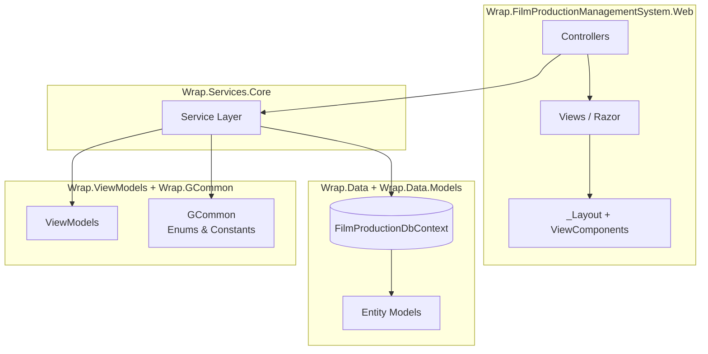
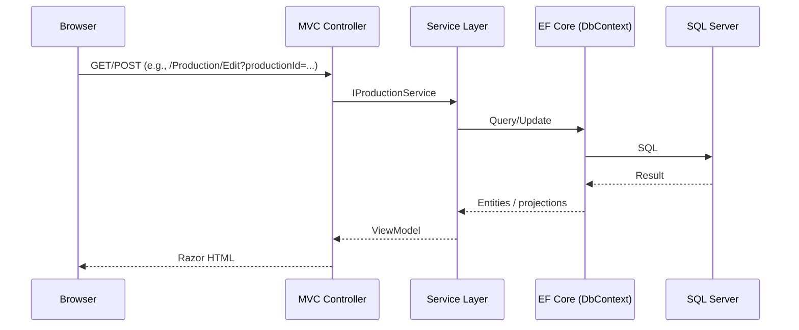
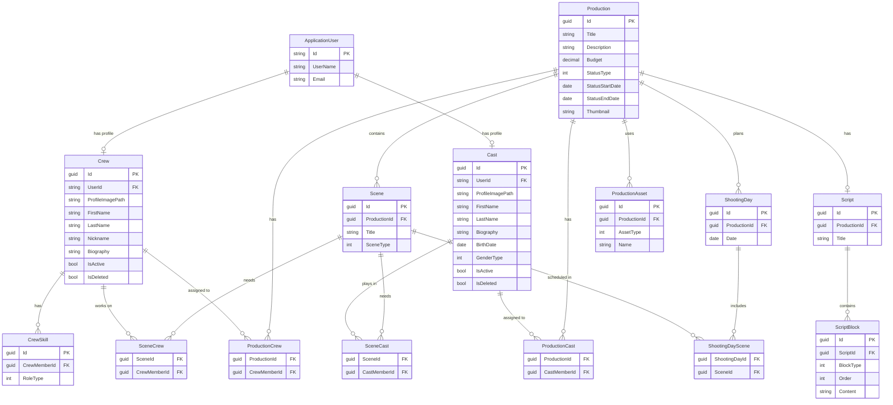
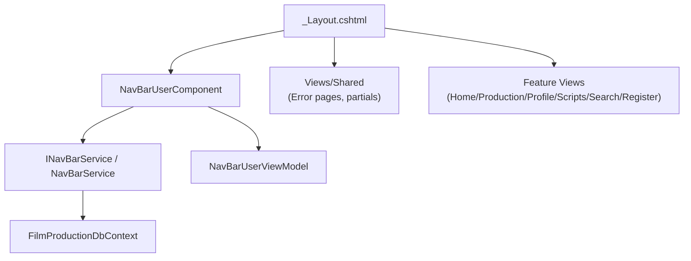

# WRAP — Film Production Management System

A web platform for **planning and managing real film productions**: productions, schedules, scripts, assets, and professional profiles (**crew & cast**) — built with **ASP.NET Core MVC**, **EF Core**, and **ASP.NET Identity**.

> The goal is to model a **real production workflow** and support decision‑making (planning, conflict visibility, consistency) — **not** to solve the scheduling optimization problem automatically.

---

## Contents

- [Project at a glance](#project-at-a-glance)
- [Key features](#key-features)
- [Architecture](#architecture)
- [Database model (ER diagram)](#database-model-er-diagram)
- [UI layout structure](#ui-layout-structure)
- [Tech stack](#tech-stack)
- [NuGet packages](#nuget-packages)
- [Getting started](#getting-started)
- [EF Core migrations (CLI + PMC)](#ef-core-migrations-cli--pmc)
- [My main achievements](#my-main-achievements)
- [What I learned](#what-i-learned)
- [License (Apache 2.0)](#license-apache-20)

---

## Project at a glance

**WRAP** is a production‑management tool for producers / production managers:
- Manage **Productions** (title, budget, status lifecycle, thumbnail)
- Organize **Scenes** and connect them to **Shooting Days**
- Maintain professional profiles for **Crew** and **Cast**
- Upload and track **Production Assets** (pre‑production visual materials / props / equipment references)
- Use a **Dashboard** overview + **search** for people/resources
- Work with **Scripts** (Script + ScriptBlocks), ready for an editor‑style workflow

---

## Key features

### Authentication + domain roles (Crew / Cast)
- Authentication is centralized in **ASP.NET Identity**.
- Domain entities (**Crew**, **Cast**) represent professional roles and remain separate from auth concerns.
- Both roles can authenticate; their profiles are linked **1:1** to `ApplicationUser`.

### Production lifecycle modeling (flexible status design)
- `ProductionStatusType` models a real‑world lifecycle without enforcing a rigid workflow, so different projects can use the lifecycle differently.
- UI groups “specific statuses” under abstract phases (Pre‑production / Production / Post‑production / Distribution).

### Scheduling (supporting decisions, not optimizing)
- Productions have **ShootingDays** and **Scenes**; a scene can be “scheduled into” shooting days via join entities.
- The scheduling module focuses on **detecting conflicts / inconsistencies** and presenting structure, rather than auto‑generating an optimal schedule.

### Two‑step registration (Crew)
- Step 1: personal info + optional profile picture upload (`wwwroot/img/profile`)
- Step 2: select skills (stored via `CrewSkill` and `CrewRoleType`)
- Draft state stored via Session JSON (keeps controller thin)

### Uploads
- Profile pictures + production thumbnails saved under `wwwroot/img/...` and stored as **web paths** (portable across OS).

### Dashboard + navigation
- Dashboard overview stats + quick actions
- Navbar rendered via ViewComponent for consistent user badge and avatar

---

## Architecture

### Layered structure (SRP-friendly, thin controllers)



### Typical request flow



---

## Database model (ER diagram)

> Relationships are derived from `Wrap.Data.Models` and follow an explicit join-entity approach for many‑to‑many mappings.



Notes:
- **Age is derived** dynamically from BirthDate to avoid inconsistency.
- SQL Server restriction: multiple cascade delete paths are avoided; cascading is kept only where it makes logical sense.

---

## UI layout structure

Navbar and shared UI are driven by `_Layout.cshtml` with a user-aware ViewComponent.



---

## Tech stack

- **.NET 8**
- **ASP.NET Core MVC**
- **ASP.NET Identity**
- **Entity Framework Core (SQL Server)**
- **Bootstrap 5** + **Bootstrap Icons**
- Session state (for multi-step registration drafts)

---

## NuGet packages

From the solution `.csproj` files:

### Web (`Wrap.FilmProductionManagementSystem.Web`)
- Microsoft.AspNetCore.Diagnostics.EntityFrameworkCore
- Microsoft.AspNetCore.Identity.EntityFrameworkCore
- Microsoft.EntityFrameworkCore.SqlServer
- Microsoft.EntityFrameworkCore.Tools
- Microsoft.VisualStudio.Web.CodeGeneration.Design

### Data (`Wrap.Data`)
- Microsoft.EntityFrameworkCore.SqlServer
- Microsoft.EntityFrameworkCore.Tools
- Microsoft.EntityFrameworkCore.Design

(Other projects keep dependencies minimal.)

---

## Getting started

### 1) Requirements
- .NET SDK **8.x**
- SQL Server (local or container)
- EF Core tooling (`dotnet-ef`)

### 2) Configure connection string
Preferred: **User Secrets**.

```bash
dotnet user-secrets set "ConnectionStrings:MyDevConnection" "Server=...;Database=...;User Id=...;Password=...;TrustServerCertificate=True"
```

Fallback: `appsettings.json` → `DefaultConnection`.

### 3) Apply migrations + run
```bash
dotnet ef database update --project Wrap.Data/Wrap.Data.csproj --startup-project Wrap.FilmProductionManagementSystem.Web

dotnet run --project Wrap.FilmProductionManagementSystem.Web
```

---

## EF Core migrations (CLI + PMC)

### .NET CLI (Mac/Linux/Windows)

Create migration:
```bash
dotnet ef migrations add <MigrationName> \
  --project Wrap.Data/Wrap.Data.csproj \
  --startup-project Wrap.FilmProductionManagementSystem.Web/Wrap.FilmProductionManagementSystem.Web.csproj
```

Update database:
```bash
dotnet ef database update \
  --project Wrap.Data/Wrap.Data.csproj \
  --startup-project Wrap.FilmProductionManagementSystem.Web/Wrap.FilmProductionManagementSystem.Web.csproj
```

Remove last migration:
```bash
dotnet ef migrations remove \
  --project Wrap.Data/Wrap.Data.csproj \
  --startup-project Wrap.FilmProductionManagementSystem.Web/Wrap.FilmProductionManagementSystem.Web.csproj
```

(Commands are documented as part of the project docs for universal access.)

### Package Manager Console (Windows / Visual Studio)

```powershell
Add-Migration <MigrationName> -Project Wrap.Data -StartupProject Wrap.FilmProductionManagementSystem.Web
Update-Database -Project Wrap.Data -StartupProject Wrap.FilmProductionManagementSystem.Web
Remove-Migration -Project Wrap.Data -StartupProject Wrap.FilmProductionManagementSystem.Web
```

---

## My main achievements

- Designed a **realistic production domain model** (productions, scenes, shooting days, assets, crew/cast profiles) with explicit join entities for clarity and extensibility.
- Kept **authentication concerns separate** from domain profiles (IdentityUser vs Crew/Cast), following SOLID boundaries.
- Implemented a **status lifecycle** that models reality while staying flexible across projects.
- Structured the solution into clean layers (Web / Services / Data / DataModels / ViewModels / Shared enums / Global Commons), keeping controllers thin.

---

## What I learned

- Applying **SOLID/SRP** in an ASP.NET MVC multi-project solution (services + view models + thin controllers)
- EF Core relationship modeling (1:1, 1:N, explicit many‑to‑many join entities, cascade delete constraints)
- Practical UI engineering with Razor + Bootstrap + ViewComponents

---

## License (Apache 2.0)

I chose **Apache License 2.0** because it:
- is **permissive** (commercial + private use allowed with minimal restrictions)
- includes an explicit **patent grant** (important for real-world reuse)
- is widely adopted and contributor-friendly (clear notice requirements)

