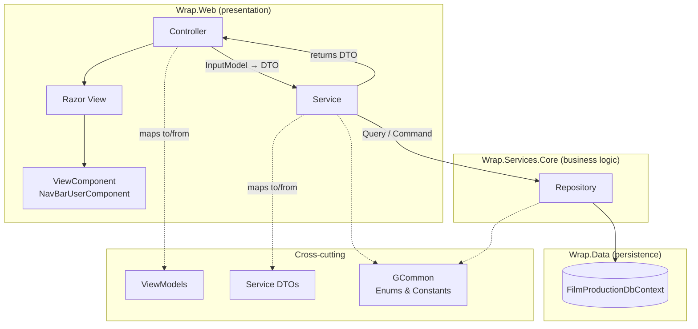
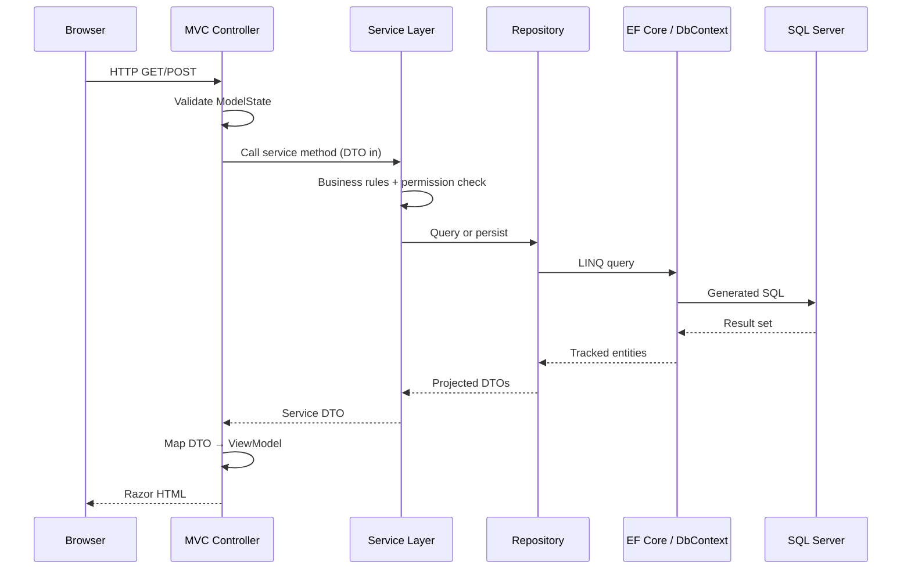
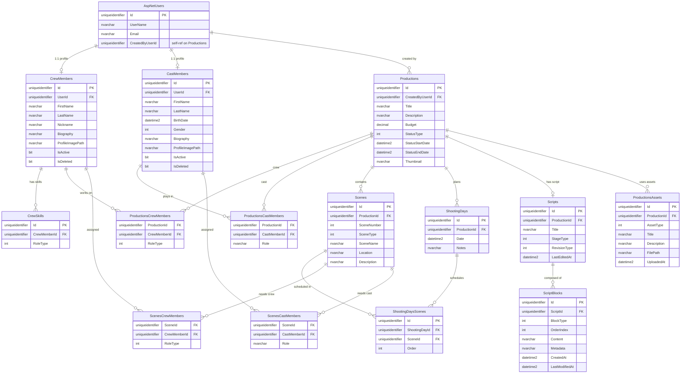
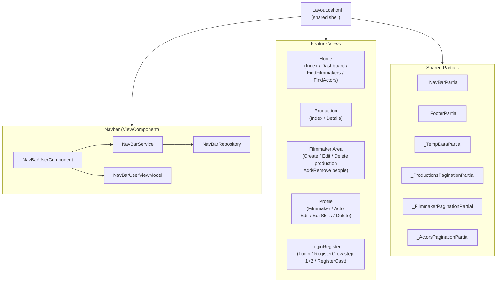

# WRAP — Film Production Management System

**WRAP** is a web platform for **planning and managing real film productions** — productions, people (crew & cast), schedules, scripts, and assets — built with **ASP.NET Core MVC**, **Entity Framework Core**, and **ASP.NET Identity**.

> The goal is to model a realistic production workflow with proper ownership, permissions, and role-based access, supported by a clean, layered architecture: thin controllers, service layer, and repository pattern.

---

## Contents

- [Project at a glance](#project-at-a-glance)
- [Core features](#core-features)
- [Authorization model](#authorization-model)
- [Architecture](#architecture)
- [Database model](#database-model)
- [UI structure](#ui-structure)
- [Tech stack](#tech-stack)
- [Getting started](#getting-started)
- [EF Core migrations](#ef-core-migrations)
- [Testing](#testing)
- [License](#license)

---

## Project at a glance

A filmmaker can create a production with a thumbnail, budget, and a flexible status lifecycle. The app maintains separate domain profiles for crew and cast, and provides **Find Filmmakers** and **Find Actors** pages with search, filtering, and pagination. When those pages are opened in a production context, eligible users can add or remove people from a specific production.

Scheduling is supported through scenes, shooting days, and a join entity that connects scenes to shooting days. Scripts are modeled with `Scripts` and `ScriptBlocks` (editor-ready structure). Assets are tracked per production via `ProductionAssets`.

---

## Core features

### Authentication and two application roles

Authentication is handled through ASP.NET Identity. Two roles are seeded at startup: **Filmmaker** and **Actor**. Registration assigns the corresponding Identity role automatically — crew registration uses `AddToRoleAsync(user, "Filmmaker")` and cast registration uses `AddToRoleAsync(user, "Actor")`.

### Production ownership and automatic Director assignment

Each production stores its creator via `Productions.CreatedByUserId` (FK → `AspNetUsers.Id`). When a filmmaker creates a production, the creator is also inserted into `ProductionsCrewMembers` for that production with the domain role **Director**.

### Production management permissions (domain-based)

Editing and deleting a production are guarded at the domain level, not by Identity roles alone. Only users who are a **Director** or **Producer** of that specific production can manage it. The web UI also hides edit/delete actions when the current user lacks permission.

### Find people — global browsing with optional production context

Everyone can browse and filter filmmakers and actors. If the page is opened with a `ProductionId` in the query string, the UI shows a "Context: Production" indicator. A production manager can then add a filmmaker with a role picker (department → role) or add an actor with a free-text role name (character). Remove operations are implemented as POST actions.

### Two-step crew registration

Step 1 collects personal info and an optional profile picture. Step 2 lets the user select skills (stored via `CrewSkills` and `CrewRoleType`). The draft is kept in Session JSON between steps to keep the controller thin and stateless between requests.

### Soft delete and global query filters

Crew and cast profiles support `IsDeleted`. EF Core global query filters automatically exclude deleted profiles from all queries, so no manual filtering is needed in services or repositories.

### Uploads

Profile pictures + production thumbnails are saved under `wwwroot/img/...` and stored as **web paths** (portable across OS). Images can be updated and deleted.

---

## Authorization model

WRAP uses two complementary layers.

**Identity roles** control broad access to sections of the app. The `Filmmaker` role gates entry to the Filmmaker area and its production-management actions.

**Domain roles** are per-production and drive real permissions. Crew roles are stored in `ProductionsCrewMembers(RoleType)` and cast roles in `ProductionsCastMembers(Role)` as free text. This naturally supports future department-based restrictions (e.g., only the writing department can edit scripts) while keeping the current model simple.

```
┌─────────────────────────────────────────────────┐
│               ASP.NET Identity                  │
│   Filmmaker role → can access /Filmmaker area   │
│   Actor role    → profile + browsing only       │
└──────────────────────┬──────────────────────────┘
                       │
                       ▼
┌─────────────────────────────────────────────────┐
│              Domain permission check            │
│   ProductionsCrewMembers.RoleType               │
│   Director / Producer → can edit & delete       │
│   Other crew / cast  → read-only on production  │
└─────────────────────────────────────────────────┘
```

---

## Architecture

### Solution layout

The solution is split into focused projects, each with a single responsibility.

```
FilmProductionManagementSystem.sln
│
├── Wrap.FilmProductionManagementSystem.Web   ← Entry point: controllers, views, DI setup
├── Wrap.Web.Infrastructure                   ← Extension methods, SlugGenerator, DI helpers
├── Wrap.Web.ViewModels                       ← Input models and view models (no logic)
│
├── Wrap.Services.Core                        ← Business logic, validation, permission checks
├── Wrap.Services.Models                      ← Service-layer DTOs (no EF references)
│
├── Wrap.Data                                 ← DbContext, repositories, migrations, seeding
├── Wrap.Data.Models                          ← EF entity classes
│
├── Wrap.GCommon                              ← Enums, constants, shared validation attributes
│
├── Wrap.Services.Tests                       ← xUnit tests for the service layer
└── Wrap.Infrastructure.Tests                 ← xUnit tests for infrastructure helpers
```

### Layered pipeline (SRP)

Each layer has one job and talks only to the layer directly below it.


```mermaid
flowchart TB
  subgraph Web["Wrap.Web  (presentation)"]
    C[Controller] -->|"InputModel → DTO"| Svc
    C --> V[Razor View]
    V --> VC[ViewComponent\nNavBarUserComponent]
  end

  subgraph Services["Wrap.Services.Core  (business logic)"]
    Svc[Service] -->|"Query / Command"| Repo
    Svc -->|"returns DTO"| C
  end

  subgraph Data["Wrap.Data  (persistence)"]
    Repo[Repository] --> DB[(FilmProductionDbContext)]
  end

  subgraph Cross["Cross-cutting"]
    VM[ViewModels]
    DTOs[Service DTOs]
    GC[GCommon\nEnums & Constants]
  end

  C -.->|"maps to/from"| VM
  Svc -.->|"maps to/from"| DTOs
  Svc -.-> GC
  Repo -.-> GC
```

### Typical request flow


```mermaid
sequenceDiagram
  participant Browser
  participant Controller as MVC Controller
  participant Service   as Service Layer
  participant Repo      as Repository
  participant EF        as EF Core / DbContext
  participant DB        as SQL Server

  Browser->>Controller: HTTP GET/POST
  Controller->>Controller: Validate ModelState
  Controller->>Service: Call service method (DTO in)
  Service->>Service: Business rules + permission check
  Service->>Repo: Query or persist
  Repo->>EF: LINQ query
  EF->>DB: Generated SQL
  DB-->>EF: Result set
  EF-->>Repo: Tracked entities
  Repo-->>Service: Projected DTOs
  Service-->>Controller: Service DTO
  Controller->>Controller: Map DTO → ViewModel
  Controller-->>Browser: Razor HTML
```

---

## Database model (ER diagram)

The diagram below reflects the actual SQL Server schema (`Wrap.Data.Models` + EF Fluent API configuration).


```mermaid
erDiagram
  AspNetUsers {
    uniqueidentifier Id PK
    nvarchar UserName
    nvarchar Email
    uniqueidentifier CreatedByUserId "self-ref on Productions"
  }

  CrewMembers {
    uniqueidentifier Id       PK
    uniqueidentifier UserId   FK
    nvarchar  FirstName
    nvarchar  LastName
    nvarchar  Nickname
    nvarchar  Biography
    nvarchar  ProfileImagePath
    bit       IsActive
    bit       IsDeleted
  }

  CastMembers {
    uniqueidentifier Id       PK
    uniqueidentifier UserId   FK
    nvarchar  FirstName
    nvarchar  LastName
    datetime2 BirthDate
    int       Gender
    nvarchar  Biography
    nvarchar  ProfileImagePath
    bit       IsActive
    bit       IsDeleted
  }

  CrewSkills {
    uniqueidentifier Id           PK
    uniqueidentifier CrewMemberId FK
    int              RoleType
  }

  Productions {
    uniqueidentifier Id              PK
    uniqueidentifier CreatedByUserId FK
    nvarchar  Title
    nvarchar  Description
    decimal   Budget
    int       StatusType
    datetime2 StatusStartDate
    datetime2 StatusEndDate
    nvarchar  Thumbnail
  }

  ProductionsCrewMembers {
    uniqueidentifier ProductionId  FK
    uniqueidentifier CrewMemberId  FK
    int              RoleType
  }

  ProductionsCastMembers {
    uniqueidentifier ProductionId  FK
    uniqueidentifier CastMemberId  FK
    nvarchar         Role
  }

  Scenes {
    uniqueidentifier Id          PK
    uniqueidentifier ProductionId FK
    int     SceneNumber
    int     SceneType
    nvarchar SceneName
    nvarchar Location
    nvarchar Description
  }

  ShootingDays {
    uniqueidentifier Id           PK
    uniqueidentifier ProductionId FK
    datetime2 Date
    nvarchar  Notes
  }

  ShootingDaysScenes {
    uniqueidentifier Id            PK
    uniqueidentifier ShootingDayId FK
    uniqueidentifier SceneId       FK
    int              Order
  }

  ScenesCrewMembers {
    uniqueidentifier SceneId      FK
    uniqueidentifier CrewMemberId FK
    int              RoleType
  }

  ScenesCastMembers {
    uniqueidentifier SceneId      FK
    uniqueidentifier CastMemberId FK
    nvarchar         Role
  }

  Scripts {
    uniqueidentifier Id           PK
    uniqueidentifier ProductionId FK
    nvarchar  Title
    int       StageType
    int       RevisionType
    datetime2 LastEditedAt
  }

  ScriptBlocks {
    uniqueidentifier Id       PK
    uniqueidentifier ScriptId FK
    int      BlockType
    int      OrderIndex
    nvarchar Content
    nvarchar Metadata
    datetime2 CreatedAt
    datetime2 LastModifiedAt
  }

  ProductionsAssets {
    uniqueidentifier Id           PK
    uniqueidentifier ProductionId FK
    int      AssetType
    nvarchar Title
    nvarchar Description
    nvarchar FilePath
    datetime2 UploadedAt
  }

  AspNetUsers   ||--o| CrewMembers          : "1:1 profile"
  AspNetUsers   ||--o| CastMembers          : "1:1 profile"
  AspNetUsers   ||--o{ Productions          : "created by"

  CrewMembers   ||--o{ CrewSkills           : "has skills"

  Productions   ||--o{ ProductionsCrewMembers : "crew"
  CrewMembers   ||--o{ ProductionsCrewMembers : "works on"

  Productions   ||--o{ ProductionsCastMembers : "cast"
  CastMembers   ||--o{ ProductionsCastMembers : "plays in"

  Productions   ||--o{ Scenes              : "contains"
  Productions   ||--o{ ShootingDays        : "plans"
  Productions   ||--o| Scripts             : "has script"
  Productions   ||--o{ ProductionsAssets   : "uses assets"

  ShootingDays  ||--o{ ShootingDaysScenes  : "schedules"
  Scenes        ||--o{ ShootingDaysScenes  : "scheduled in"

  Scenes        ||--o{ ScenesCrewMembers   : "needs crew"
  CrewMembers   ||--o{ ScenesCrewMembers   : "assigned"
  Scenes        ||--o{ ScenesCastMembers   : "needs cast"
  CastMembers   ||--o{ ScenesCastMembers   : "assigned"

  Scripts       ||--o{ ScriptBlocks        : "composed of"
```

> **Design notes:**
> Age is derived dynamically from `BirthDate` to avoid stale data. Multiple cascade-delete paths are avoided per SQL Server restrictions — cascading is kept only where logically necessary. Many-to-many relationships use explicit join entities (e.g., `ProductionsCrewMembers`, `ShootingDaysScenes`) to allow storing extra data such as `RoleType` or `Order`.

---

## UI structure

The UI is driven by a shared `_Layout.cshtml` with a user-aware `NavBarUserComponent`. All feature pages inherit the layout. Pagination follows a consistent chunked-with-ellipses pattern across productions, filmmakers, and actors.


```mermaid
flowchart TB
  Layout["_Layout.cshtml\n(shared shell)"]

  subgraph NavBar["Navbar (ViewComponent)"]
    VC["NavBarUserComponent"]
    NavSvc["NavBarService"]
    NavRepo["NavBarRepository"]
    NavVM["NavBarUserViewModel"]
    VC --> NavSvc --> NavRepo
    VC --> NavVM
  end

  subgraph Pages["Feature Views"]
    Home["Home\n(Index / Dashboard /\nFindFilmmakers / FindActors)"]
    Prod["Production\n(Index / Details)"]
    FilmmakerArea["Filmmaker Area\n(Create / Edit / Delete production\nAdd/Remove people)"]
    Profile["Profile\n(Filmmaker / Actor\nEdit / EditSkills / Delete)"]
    Auth["LoginRegister\n(Login / RegisterCrew step 1+2 / RegisterCast)"]
  end

  subgraph Partials["Shared Partials"]
    direction LR
    P1["_NavBarPartial"]
    P2["_FooterPartial"]
    P3["_TempDataPartial"]
    P4["_ProductionsPaginationPartial"]
    P5["_FilmmakerPaginationPartial"]
    P6["_ActorsPaginationPartial"]
  end

  Layout --> NavBar
  Layout --> Pages
  Layout --> Partials
```

---

## Tech stack

| Layer | Technology |
|---|---|
| Runtime | .NET 8 |
| Web framework | ASP.NET Core MVC |
| Authentication | ASP.NET Identity |
| ORM | Entity Framework Core (SQL Server) |
| Front-end | Bootstrap 5 + Bootstrap Icons + jQuery + custom CSS and vanila JS |
| Session | ASP.NET Core Session (multi-step registration draft) |
| Image storage | File system under `wwwroot/img/` (stored as web paths) |
| Containerization | Docker + docker-compose (SQL Server + Web) |

---

## Getting started

### Requirements

.NET SDK 8.x, SQL Server (local or via Docker), and `dotnet-ef` installed globally.

### 1 — Configure the connection string

User Secrets (recommended — keeps credentials out of source control):

```bash
dotnet user-secrets set "ConnectionStrings:MyDevConnection" \
  "Server=...;Database=...;User Id=...;Password=...;TrustServerCertificate=True" \
  --project Wrap.FilmProductionManagementSystem.Web
```

Fallback: `appsettings.json` → `DefaultConnection`.

### 2 — Apply migrations and run

```bash
dotnet ef database update \
  --project Wrap.Data/Wrap.Data.csproj \
  --startup-project Wrap.FilmProductionManagementSystem.Web/Wrap.FilmProductionManagementSystem.Web.csproj

dotnet run --project Wrap.FilmProductionManagementSystem.Web
```

### 3 — Docker (optional)

```bash
docker-compose up --build
```

The `docker-compose.yml` spins up both SQL Server and the web app.

---

## EF Core migrations

### .NET CLI

```bash
# Add migration
dotnet ef migrations add <MigrationName> \
  --project Wrap.Data/Wrap.Data.csproj \
  --startup-project Wrap.FilmProductionManagementSystem.Web/Wrap.FilmProductionManagementSystem.Web.csproj \
  --context FilmProductionDbContext

# Apply
dotnet ef database update \
  --project Wrap.Data/Wrap.Data.csproj \
  --startup-project Wrap.FilmProductionManagementSystem.Web/Wrap.FilmProductionManagementSystem.Web.csproj \
  --context FilmProductionDbContext

# Roll back last
dotnet ef migrations remove \
  --project Wrap.Data/Wrap.Data.csproj \
  --startup-project Wrap.FilmProductionManagementSystem.Web/Wrap.FilmProductionManagementSystem.Web.csproj \
  --context FilmProductionDbContext

# Drop database
dotnet ef database drop \
  --project Wrap.Data/Wrap.Data.csproj \
  --startup-project Wrap.FilmProductionManagementSystem.Web/Wrap.FilmProductionManagementSystem.Web.csproj \
  --context FilmProductionDbContext

```

### Package Manager Console (Visual Studio)

```powershell
Add-Migration <MigrationName> -Project Wrap.Data -StartupProject Wrap.FilmProductionManagementSystem.Web
Update-Database               -Project Wrap.Data -StartupProject Wrap.FilmProductionManagementSystem.Web
Remove-Migration              -Project Wrap.Data -StartupProject Wrap.FilmProductionManagementSystem.Web
```

---

## Testing

Two NUnit test projects cover the main layers.

`Wrap.Services.Tests` targets service-layer logic: `ProductionServiceTests`, `FindPeopleServiceTests`, `CrewProfileServiceTests`, `CastProfileServiceTests`, `LoginRegisterServiceTests`, `NavBarServiceTests`, `HomeServiceTests`, image strategy tests, registration handler tests, and session extension tests.

`Wrap.Infrastructure.Tests` targets infrastructure helpers: `ApplicationRoleSeederTests`, `ConventionRegistrationExtensionsTests`, `SlugGeneratorTests`, `DisplayNameFormatterTests`, `IsAfterTests`, `CrewRolesDepartmentCatalogTests`, `ProductionStatusAbstractionCatalogTests`, and DI extension tests.

```bash
dotnet test
```

---

## License

**Apache 2.0** — permissive (commercial and private use allowed), includes an explicit patent grant, and is widely adopted for open-source contributor clarity.
